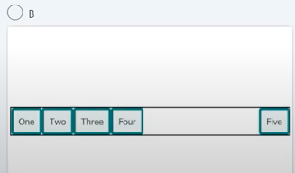
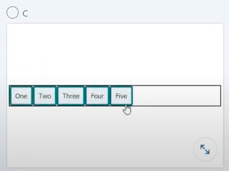

## Front-end Development

#### Q1. Which image matches the flex layout defined in this style rule?

```css
.container {
  display: flex;
}

.container div:last-child {
  margin-left: auto;
}
```

- [ ] 
- [x]
  
- [ ] 
- [ ] 

#### Q2. Variables declared with the let keyword have what type of scope?

- [x] function scope
- [ ] block scope
- [ ] inline scope
- [ ] global scope

#### Q3. Why would you surround a piece of text with <h1></h1> tags?

- [ ] to indicate that this text is the main heading on the page
- [ ] to make the text bold
- [ ] to ensure that search engines treat the keywords as being important for this page
- [ ] to demonstrate to screen readers that this text is important

#### Q4. When might an empty alt attribute be the correct value?

- [ ] when you cannot think of useful alt text
- [ ] when you don't think it would be interesting to someone who cannot see it
- [ ] when the image has come from a CMS
- [ ] when the image is purely decorative

#### Q5. Which attribute must have a unique value each time it is used in an HTML document?

- [ ] title
- [ ] class
- [ ] style
- [ ] id

#### Q6. Which CSS property will not trigger layout recalculation?

- [ ] top
- [ ] opacity
- [ ] width
- [ ] height

#### Q7. What will be the value of selected?

```javascript
let pocket = ['turnip', 'stone', 'log', 'apple'];
let selected = pocket[1];
```

- [ ] log
- [ ] apple
- [ ] stone
- [ ] turnip

#### Q8. What does the === comparison operator do?

- [x] It sets one variable equal to another in both value and type
- [ ] It tests for equality of type only
- [ ] It tests for equality of value only
- [ ] It tests for equality of value and type

#### Q9. In the following code, the variable `fruit` has been assigned a value of apple. How would you change the value to plum?

```javascript
let fruit = 'apple';
```

- [ ] `let fuit = 'plum'`
- [ ] `var fuit = 'plum'`
- [ ] `const fuit = 'plum'`
- [ ] `fuit = 'plum'`

#### Q10. What is the <lable> element used for?

- [ ] to identify the difference parts of a figure
- [ ] to explain what needs to be entered into a form field
- [ ] as a caption for images
- [ ] as a heading for tables

#### Q11. The browser finds some CSS that it does not understand. What is likely happen?

- [ ] The page will not display
- [ ] An error message will be displayed
- [ ] The browser will not load the stylesheet
- [ ] The browser will ignore the unknown CSS

#### Q12. In this code, what is the term for the h1?

```css
h1 {
  color: red;
  font-size: 5em;
}
```

- [ ] selector
- [ ] combinator
- [ ] declarator
- [ ] markup

#### Q13. Which HTML will result in text being highlighted in yellow?

```css
.highlight {
  background-color: yellow;
}
```

- [ ] `<span class="highlight">#BLM</span>`
- [ ] `<span style="highlight">#BLM</span>`
- [ ] `<highlight">#BLM</span>`
- [ ] `<div id="highlight">#BLM</span>`

#### Q14. Which choice is not a value of the type attribute of the <input> element?

- [ ] range
- [ ] address
- [ ] date
- [ ] password

#### Q15. You have used `dispaly: none` in your stylesheet. Which users will be able to see or hear this content?

- [ ] all users
- [ ] users who can see the content on screen
- [ ] no users
- [ ] screen reader users
