## Microsoft Excel

#### Q1. Some of your data in Column C is displaying as hashtags (#) because the column is too narrow. How can you widen Column C just enough to show all the data?

- [ ] Right-click column C, select Format Cells, and then select Best-Fit.
- [ ] Right-click column C and select Best-Fit.
- [ ] Double-click column C.
- [x] Double-click the vertical boundary between columns C and D.

#### Q2. Which two functions check for the presence of numerical or nonnumerical characters in cells?

- [x] ISNUMBER and ISTEXT
- [ ] ISNUMBER and ISALPHA
- [ ] ISVALUE AND ISNUMBER
- [ ] ISVALUE and ISTEXT

#### Q3. If you drag the fill handle (lower-right corner) of cell A2 downward into cells A3, A4, and A5, what contents will appear in those cells?

- [ ] Jan, Jan, Jan
- [ ] Feb, Mar, blank cell
- [x] Feb, Mar, Apr
- [ ] FEB, MAB, APR

#### Q4. If cell A3 contains the text THE DEATH OF CHIVALRY, what will the function =PROPER(A3) return?

- [ ] the death of chivalry
- [ ] The death of Chivalry
- [ ] THE DEATH OF CHIVALRY
- [x] The Death Of Chivalry

#### Q5. In the worksheet below, you want to use Data > Subtotal to show a subtotal value per sport. What must you do BEFORE applying the Subtotal function?

- [ ] Sort by the data in Column E.
- [ ] Format the data in Column D.
- [x] Sort by the data in Column D.
- [ ] Format the data in Column E.

#### Q6. When editing a cell, what do you press to cycle between relative, mixed, and absolute cell references?

- [ ] Alt+F4 (Windows) or Option+F4 (Mac)
- [ ] Alt+Shift+4 (Windows) or Option+Shift+4 (Mac)
- [ ] Ctrl+Shift+4 (Windows) or Command+Shift+4 (Mac)
- [x] the F4 (Windows) or Command+T (Mac)

#### Q7. You need to add a line chart showing a sales trends over the last 12 months and you have only a little space to work with. How can you convey the required information within a single cell?

- [ ] Add an image of the chart to a comment.
- [ ] Add a hyperlink to another worksheet that displays a chart when clicked.
- [ ] Add an image of the chart to the worksheet.
- [x] Add a sparkline, a graphic that summarizes data visually within a single worksheet cell.

#### Q8. What is the best way to activate the Excel Help system?

- [ ] Right-click anywhere and select Help.
- [x] Press F1 or click the Help tab in the ribbon.
- [ ] Press F10.
- [ ] all of these answers.

#### Q9. Which format will display the value 27,500,000 as 27.5?

- [ ] ##,###,,
- [x] ###.0,,
- [ ] 999.9,,
- [ ] ###,###.0,

#### Q10. When using Goal Seek, you can find a target result by varying \_ at most.

- [ ] three inputs
- [ ] four inputs
- [ ] two inputs
- [x] one input

#### Q11. In the image below, which option(s) can you select so that the appropriate field headers appear in cells A4 and B3 instead of the terms Row Labels and Column Labels, respectively?

- [ ] Show in Tabular Form
- [ ] Show in Compact Form
- [ ] Show in Compact For or Show in Outline Form
- [x] Show in Tabular Form or Show in Outline Form

#### Q12. A cell contains the value 7.877 and you want it to display as 7.9. How can you accomplish this?

- [ ] Use the ROUND() function.
- [x] Click the Decrease Decimal button twice.
- [ ] In the cells group on the Home tab, click Format > Format Cells. Then click the Alignment tab and select Right Indent.
- [ ] Click the Decrease Decimal button once.

#### Q13. Which formula is NOT equivalent to all of the others?

- [ ] =A3+A4+A5+A6
- [ ] =SUM(A3:A6)
- [x] =SUM(A3,A6)
- [ ] =SUM(A3,A4,A5,A6)

#### Q14. Which custom format will make the cells in column A appear like the corresponding cells in column B?

- [ ] MMM-YYYY
- [x] MMMM-YYYY
- [ ] MMMM&"-"&YYYY
- [ ] M-YYYY

#### Q15. Which function returns a reference to a cell (or cell range) that is a specified distance from a base cell?

- [x] OFFSET
- [ ] VLOOKUP
- [ ] INDEX
- [ ] MATCH

#### Q16. You're working with columns whose width and font-size should not be changed. Yet the columns are too narrow to display all the text in each cell. What tool should you use to solve the problem?

- [ ] Sparklines
- [x] Wrap Text
- [ ] Fill Handle
- [ ] Centered Alignment

#### Q17. Of the four chart types listed, which works best for summarizing time-based data?

- [ ] pie chart
- [x] line chart
- [ ] XY scatter chart
- [ ] bar chart

#### Q18. The AutoSum formulas in the range C9:F9 below return unexpected values. Why is this?

- [ ] The AutoSum formulas refer to the column to the left of their cells.
- [ ] The AutoSum formulas exclude the bottom row of data.
- [x] The AutoSum formulas include the year at the top of each column in the calculation.
      `The formula bar clearly shows it's the dates (top row) included, along with the total (bottom) row. Thus, the bottom row of data is not excluded.`
- [ ] The AutoSum formulas include their own cells, creating a circular reference.

#### Q19. The text filter in column A is designed to display only those rows where column A entry has a particular attribute. What is this attribute?

- [x] The second character in the cell is 9.
- [ ] The number 9 appears one or more times within the cell.
- [ ] The cell is comprised of 9 characters.
- [ ] The number 9 appears once and only once within the cell.

#### Q20. To ensure shapes and other objects are an equal left-to-right distance apart, select the shapes, click Page Layout > Align, and then click \_.

- [ ] Align Middle
- [ ] Distribute Horizontally
- [x] Distribute Vertically
- [ ] Align Center

#### Q21. An organization chart, which shows the hierarchy within a company or organization, is available as \_ that is included with Excel.

- [ ] a 3D model
- [x] SmartArt
- [ ] a Treemap chart
- [ ] a drawing object

#### Q22. You want to be able to restrict values allowed in a cell and need to create a drop-down list of values from which users can choose. Which feature should you use?

- [ ] Protect Worksheet
- [ ] Conditional Formatting
- [ ] Allow Users to Edit Ranges
- [x] Data Validation

#### Q23. To round up a value to the nearest increment of your choice, such as the next five cents, what function should you use?

- [x] ROUNDUP
- [ ] MAX
- [ ] ROUND
- [ ] CEILING

#### Q24. Which function returns the largest value amongst all values within the range H2:H30?

- [x] =MAX(H2:H30)
- [ ] =MAXIMUM(H2:H30)
- [ ] =LARGE(H2:H30,29)
- [ ] =UPPER(H2:H30,1)

#### Q25. Which chart type can display two different data series as a different series type within the same chart?

- [x] XY chart
- [ ] clustered column
- [ ] bubble chart
- [ ] combo chart

#### Q26. In the image below, what does clicking the button indicated by the green arrow do?

- [ ] Hides or shows the formula bar.
- [x] Selects all.
- [ ] Hides or shows the ribbon.
- [ ] Selects objects.

#### Q27. Which formula returns the value in cell A1 of the worksheet named MySheet?

- [x] =MySheet!A1
- [ ] =MySheet_A1
- [ ] =MySheet&A1
- [ ] =MySheet@A1

#### Q28. In the worksheet below, you want to copy the formatting of cell A1 into cells B1:D1. Which approach (see arrows) accomplishes this the most efficiently?

- [ ] B
- [ ] C
- [x] A
- [ ] D

#### Q29. Which formula correctly counts the number of numeric values in both B4:E4 and G4:I4?

- [ ] =COUNT(B4:E4&G4:I4)
- [ ] =COUNT(B4:E4,G4:I4)
- [ ] =COUNT(B4:E4 G4:I4)
- [x] =COUNT(B4:I4)

#### Q30. After activating a chart, which sequence adds a trendline to the chart?

- [ ] In the Format group, select Trendline from the Insert Shapes list.
- [ ] Click outside the plot area and select Add Trendline
- [ ] Click inside the plot and select Forecast.
- [x] Right-click a data series and select Add Trendline.

#### Q31. Which Excel add-in will help you find a target result by varying multiple inputs to a formula?

- [x] Goal Seek
- [ ] Power Pivot
- [ ] Data Analysis
- [ ] Solver

#### Q32. What tool would you use to prevent the input in a cell of a date outside a specific range?

- [ ] Protect Workbook
- [ ] Watch Window
- [x] Data Validation
- [ ] Filter

#### Q33. You want to apply subtotals per sport in the data below. What should you do before applying subtotals?

- [ ] Format the data in column E.
- [ ] Format the data in column D.
- [x] Sort the data in column D.
- [ ] Sort the data in column E.

#### Q34. When you sort a list of numerical value into ascending or descending order, the value in the middle of the list is the \_.

- [ ] mode
- [ ] modulus
- [ ] average
- [x] median

#### Q35. Which format setting does not change the background appearance of a cell?

- [ ] Cell style
- [ ] Fill color
- [ ] Pattern style
- [x] Font color

#### Q36. In Excel, what do most formulas begin with?

- [ ] :
- [x] =
- [ ] (
- [ ] -

#### Q37. You need to determine the commission earned by each Sales Rep, based on the Sales amounts in B3:B50 and the Commission rate specified in cell A1. You want to enter a formula in C3 and copy it down to C50. Which formula should you use?

|     | A              | B               | C                 |
| --- | -------------- | --------------- | ----------------- |
| 1   | 8.5%           | 2018 Commission |                   |
| 2   | Sales Rep      | 2018 Sales      | Commission Earned |
| 3   | Jordan Hinton  | \$123,938.00    |                   |
| 4   | Lilah Douglas  | \$5594,810.00   |                   |
| 5   | Karyn Reese    | \$235,954.00    |                   |
| 6   | Chiquita Walsh | \$684,760.00    |                   |

- [ ] =\$A1\*B3
- [x] =$A$1\*B3
- [ ] =A1\*\$B3
- [ ] =A1\*B3

#### Q38. If you start a date series by dragging down the fill handle of a single cell that contains the date 12/1/19, what will you get?

- [x] a series of consecutive days following the initial date
- [ ] a series of days exactly one month apart
- [ ] a series of days identical to the initial date
- [ ] a series of days exactly one year apart

#### Q39. To discover how many cells in a range contain values that meet a single criterion, use the \_ function.

- [ ] COUNT
- [ ] SUMIFS
- [ ] COUNTA
- [x] COUNTIF

#### Q40. Your worksheet has the value 27 in cell B3. What value is returned by the function =MOD (B3,6)?

- [ ] 4
- [ ] 1
- [ ] 5
- [x] 3

#### Q41. For an IF function to check whether cell B3 contains a value between 15 and 20 inclusively, what condition should you use?

- [ ] OR(B3=>15,B3<=20)
- [x] AND (B3>=15,B3<=20)
- [ ] OR(B3>15,B3<20)
- [ ] AND(B3>15, B3<20)

#### Q42. Which format setting does not change the background appearance of a cell?

- [ ] Fill color
- [x] Font Color
- [ ] Pattern Style
- [ ] Cell Style

#### Q43. The charts below are based on the data in cells A3:G5. The chart on the right was created by copying the one on the left. Which ribbon button was clicked to change the layout of the chart on the right?

- [ ] Move Chart
- [ ] Switch Row/Column
- [ ] Quick Layout
- [x] Change Chart Type

#### Q44. Cell A20 displays an orange background when its value is 5. Changing the value to 6 changes the background color to green. What type of formatting is applied to cell A20?

- [ ] Value Formatting
- [ ] Cell Style Formatting
- [x] Conditional Formatting
- [ ] Tabular format

#### Q45. What does this formula do? `=Sum(Sheet1:Sheet4!D18)`

- [ ] It adds data from cell D18 of Sheet1 and cell D18 of Sheet4
- [ ] It adds data from cell A1 of Sheet1 and cell D18 of sheet4
- [ ] It adds all data in the range A1:D18 in Sheet1, Sheet2, Sheet3 and Sheet4
- [x] It adds data from all D18 cells in Sheet1, Sheet2, Sheet3 and Sheet4

#### Q46. What is the term for an expression that is entered into a worksheet cell and begins with an equal sign?

- [ ] function
- [ ] argument
- [x] formula
- [ ] contents

#### Q47. How does the appearance of an array formula differ from that of a standard formula?

- [ ] In a worksheet cell, array formulas have a small blue triangle in the cell's upper-right corner.
- [ ] A heavy border appears around the range that is occupied by the array formula.
- [x] In the formula bar, an array formula appears surrounded by curly brackets.
- [ ] When a cell that contains an array formula is selected, range finders appear on the worksheet around the formula's precedent cells.

#### Q48. In a worksheet, column A contains employee last names, column B contains their middle initials (if any), and column C contains their first names. Which tool can combine the last names, initials, and first names in column D without using a worksheet formula?

- [x] Concatenation
- [ ] Columns to Text
- [ ] Flash Fill
- [ ] AutoFill

#### Q49. Which formula returns the value in cell A10 of the worksheet named Budget Variances?

- [x] ='Budget Variances'!A10
- [ ] ='Budget Variances!A10'
- [ ] ="BudgetVariances!A10"
- [ ] ="BudgetVariances"!A10

#### Q50. Which function returns the leftmost five characters in cell A1?

- [ ] =FIND(A1,1,5)
- [ ] =SEARCH(A1,5)
- [x] =LEFT(A1,5)
- [ ] =A1-RIGHT(A1,LEN(A1)-5)

#### Q51. Which function returns TRUE if cell A1 contains a text value?

- [ ] =ISALPHA(A1)
- [ ] =ISCHAR(A1)
- [ ] =ISSTRING(A1)
- [x] =ISTEXT(A1)

#### Q52. Which of these functions returns the largest value among all values within the range H2:H30?

- [ ] =UPPER(H2:30,1)
- [ ] =MAXIMUM(H2:H30)
- [x] =MAX(H2:H30)
- [ ] =LARGE(H2:H30,29)

#### Q53. You select cell A1, hover the pointer over the cell border to reveal the move icon, then drag the cell to a new location. Which ribbon commands achieve the same result?

- [ ] Cut and Fill
- [x] Cut and Paste
- [ ] Copy and Transpose
- [ ] Copy and Paste

#### Q54. You want to add a column to the PivotTable below that shows a 5% bonus for each sales rep. That data does not exists in the original data table. How can you do this without adding more data to the table?

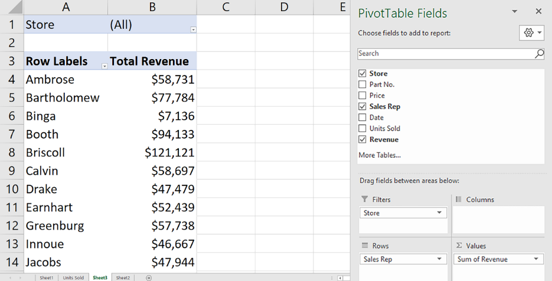

- [ ] Add a new PivotTable field.
- [ ] Add a calculated item
- [ ] Add a new Summarize Value By field.
- [x] Add a calculated field.

#### Q55. You need to determine the commission earned by each Sales rep, based on the Sales amount in B3:B50 and the Commission rate specified in cell A1. You want to enter a formula in C3 and copy it down to C50. Which formula should you use?

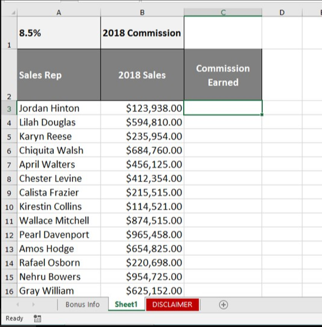

- [ ] =A1\*$B3
- [ ] =A1\*B3
- [x] =$A$1\*B3
- [ ] =$A1\*B3

#### Q56. The NOW() function returns the current date and time as 43740.665218. Which part of this value indicates the time?

- [ ] 6652
- [ ] 43740.665218
- [ ] 43740
- [x] 665218

#### Q57. Cell A2 contains the value 8 and cell B2 contains the value 9. What happens when cells A2 and B2 are merged and then unmerged?

- [ ] Both values are lost.
- [x] Cell A2 contains the value 8 and cell B2 is empty.
- [ ] Cell A2 contains the value 8 and cell B2 contains the value 9.
- [ ] Cell A2 contains the value 17 and cell B2 is empty.

#### Q58. In the formula `=VLOOKUP(A1,D1:H30,3,FALSE)`, the lookup value (A1) is being looked for in **\_**.

- [ ] column D
- [x] columns D through H
- [ ] column H
- [ ] column F

#### Q59. An .xlsx workbook is saved into .csv format. What is preserved in the new .csv file?

- [x] cell values only
- [ ] cell values and formats
- [ ] cell values and formulas
- [ ] cell value, formats, and formulas

#### Q60. Which function, when entered into cell G7, allows you to determine the sum total of annual sles for market regions 18 and greater?

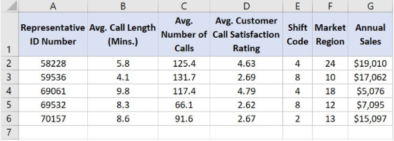

- [ ] `=SUMIF(G2:G6,">17",F2:F6)`
- [ ] `=SUM(G2:G6,">=18,F2:F6)`
- [x] `=SUMIF(F2:F6,">=18",G2:G6)`
- [ ] `=SUM(F2:F6,"18+",G2:G6)`

#### Q61. Which function, when entered into cell F2 and then dragged to cell F6, returns the performance rating text (e.g., "Good", "Poor") for each representative?

- [x] `=RIGHT(E2,LEN(E2)-27)`
- [ ] `=LEN(E2,MID(E2)-27)`
- [ ] `=LEFT(E2,LEN(E2)-27)`
- [ ] `=RIGHT(E2,MID(E2)-27)`

#### Q62. What is `Colors[Inventory]` referring to here?

`=SUMIFS(Colors[Inventory],Colors[Colors],"Orange")`

- [ ] the Inventory worksheet in the Colors workbook
- [x] the Inventory column in the Colors table
- [ ] the Colors worksheet in the Inventory workbook
- [ ] the named range Colors[Inventory], which does not use Format as Table Feature

Table[Column] can be used instead of cell references (C2:C7).
[Reference](https://support.microsoft.com/en-us/office/using-structured-references-with-excel-tables-f5ed2452-2337-4f71-bed3-c8ae6d2b276e)

#### Q63. Which VLOOKUP function, when entered into cell L2 and then dragged to cell L5, returns the average number of calls for the representative IDs listed in column J?

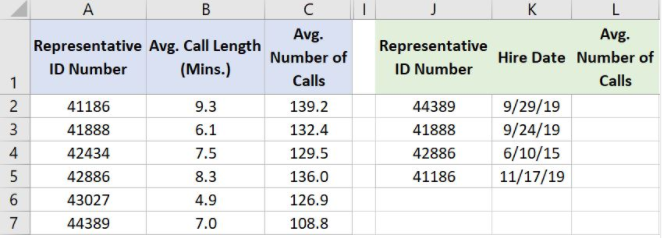

- [ ] `=VLOOKUP(A2,J2:L5,1,FALSE)`
- [ ] `=VLOOKUP(J2,A$2:C$7,1,FALSE)`
- [x] `=VLOOKUP(J2,A$2:C$7,3,FALSE)`
- [ ] `=VLOOKUP(J2,A2:C7,3,FALSE)`

`because we are interested in the value of the 3rd column of the table`

#### Q64. Which formula calculates the total value of a single row of cells across a range of columns?

- [ ] `=SUBTOTAL(C1:Y15)`
- [ ] `=SUM(15L:15Z)`
- [x] `=SUM(C15:Y15)`
- [ ] `=SUM(C11:C35)`

`the sum of columns C to Y for the same row 15`

#### Q65. Which value is returned when you enter `=LEN(C3)` into cell F3?

- [ ] 4
- [x] 5
- [ ] 3
- [ ] 2

#### Q66. How can you create the lower table from the top one when the tables are `not` linked?

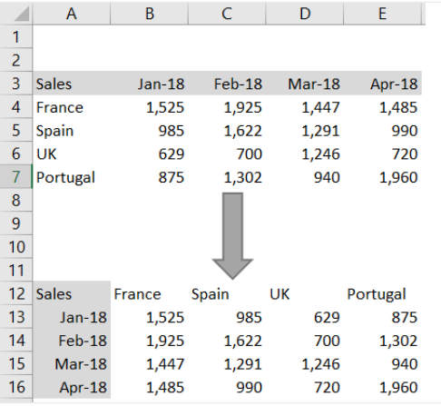

- [ ] Select `Paste Special > Values.`
- [x] Select `Paste Special > Transpose.`
- [ ] Use the `TRANSPOSE` function
- [ ] Click `Switch Rows & Columns`

`because it needs to be transposed without creating a reference`

#### Q67. Which function returns the number of characters in a text string in cell A1?

- [ ] `=RIGHT(A1)-LEFT(A1)+1`
- [x] `=LEN(A1)`
- [ ] `=EXACT(A1)`
- [ ] `=CHARS(A1)`

#### Q68. Which formula, when entered into cell D2 and then dragged to cell D6, calculates the average total number of minutes spent on phone calls for each representative?

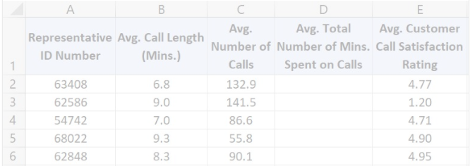

- [ ] `=B$2*C$2`
- [ ] `=$C$2/$B$2`
- [ ] `=C2/B2`
- [x] `=B2*C2`

#### Q69. The PivotTable below has one row field and two column fields. How can you pivot this table to show the column fields as subtotals of each value in the row field?

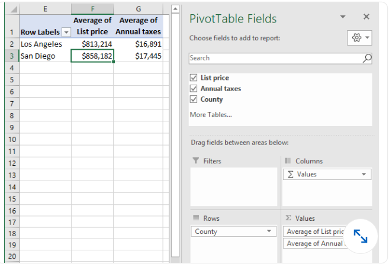

- [ ] On the PivotTable itself, drag each `Average` field into the row fields area.
- [ ] Right-click a cell in the PivotTable and select `PivotTable Options > Classic PivotTable layout`.
- [x] In the `PivotTable Fields` pane, drag `Sum Values` from the `Columns` section to a location below the field in the `Rows` section.
- [ ] In the `PivotTable Fields` pane, drag each field from the `Sum Values` section to the `Rows` section.

[Reference](https://devexpress.github.io/dotnet-eud/interface-elements-for-desktop/articles/spreadsheet/pivot-tables/group-items-in-a-pivot-table.html)

### Q70. Which Excel feature allows you to hide rows or columns with an easily visible expand/collapse?

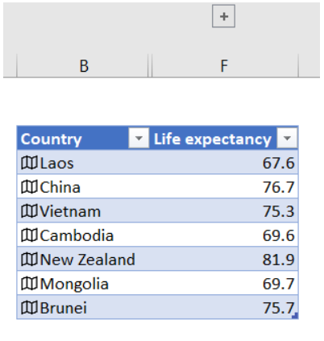

- [x] grouping
- [ ] filtering
- [ ] hiding
- [ ] cut and paste

#### Q71. Monthly revenues of 2019 are entered in B2:M2, as shown below, To get year-to-date running total revenues, what formula should you enter in B3 and autofill through M3?

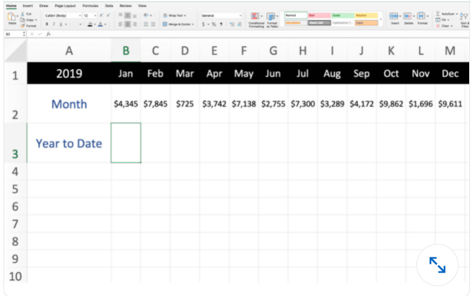

- [ ] `=SUMIF($B$2:$M$2,"COLUMN($B$2:$M$2)<=COLUMN())")`
- [x] `=SUM($B2:B2)`
- [ ] `=SUM(OFFSET($A1,0,0,1,COLUMN()))`
- [ ] `=B2+B3`

`we are calculating the running total here`

#### Q72. If a worksheet has the value 27 in cell B3, what value is returned by the `function =MOD(B3,6)`?

- [ ] 4
- [ ] 1
- [ ] 5
- [x] 3

#### Q73. From which field list was the pivotTalble created?

- [ ] rows:event, donor / values: Sum of amount
- [ ] columns: event / row:donor / values: Sum of amount
- [x] rows:donor, event / values: Sum of amount
- [ ] filter: event / row:donor / values: Sum of amount

#### Q74. In the worksheet shown below, cell C6 contains the `formula=VLOOKUP(A6,$F$2:$G$10,2,FALSE)`. What is the most likely reason that `#N/A` is returned in cell `C6` instead of mallory's `ID (2H54)`

- [ ] The absolute/relative cell references in the formula are wrong
- [ ] Cell A6 is not actualy text its a formula that need to be copied and pasted as a value
- [ ] Column C in the lookup range is not sorted properly
- [x] A trailing space probably exist in cell A6 or F7

#### Q75. What is the difference between pressing the delete key and using the clear command in the Home tab's Editing group?

- [ ] deletes removes the entire column or row. Clear removes the content from the column or row
- [x] deletes removes formulas, values and hyperlinks. clear removes formulas, values, hyperlinks, formats, comments and notes
- [ ] Delete removes the cell itself, shifting cells either up or to the left. Clear removes content and properties but does not muves cells
- [ ] Delete removes formulas and values. clear removes formulas, values, hyperlinks, formats, comments and notes

#### Q76. What is the intersection of a worksheet row and column?

- [x] cell
- [ ] selection
- [ ] element
- [ ] scalar

#### Q77. In this PivotTable, the continuous variable weight is shown in the _Row_ field. Another continuous variable is in the _Sum Values_ field. It is important to reduce a long list of body weights to a smaller set of weight categories. How do you do this?

- [ ] Use weight as a filter field as well as a row field in the PivotTable.
- [ ] Use `IF()` to show weight by categories instead of by pounds.
- [ ] Click the _Row Labels_ arrow and select _Group_.
- [x] Right-click any row field value in the PivotTable and select _Group_.

#### Q78. How can you drill down into a PivotTable to show details?

- [ ] Select the cell into which you want to drill down, right-click, and select _Show Summary_.
- [ ] Select the cell into which you want to drill down, right-click and select _Drill-down_.
- [x] Select the cell into which you want to drill down and double-click.
- [ ] Select the cell into which you want to drill down, right-click and select _Show Details > Summary Page_

#### Q79. To ensure the VLOOKUP function returns the value of an exact match, what do you need to enter into the Range_lookup field?

- [ ] 0
- [ ] 1
- [x] FALSE
- [ ] TRUE

#### Q80. Cell D2 contains the formula =B2-C2. What is the fastest way to copy that formula into cells D3:D501 (the bottom of the data set)?

- [ ] Right-click D2 and select _Fill Down_.
- [ ] Click D2's fill handle and drag it down to D501.
- [ ] On the ribbon's _Data_ tab, select _Flash fill_.
- [x] Double-click D2's fill handle.

#### Q81. This data needs to be sorted by Group, then by Last Name, then by First Name. How do you accomplish this?

- [ ] A

1. Rearrange the columns in this order: Group, Last Name, First Name.
2. Right-click any of the headers.
3. Select _Sort All_.

- [ ] B

1. Select any cell in the dataset.
2. In the _Data_ tab, click the _Sort_ button.
3. Add two levels to the default level.
4. Populate the _Sort-by_ fields in this order: Group, Last Name, First Name.

- [x] C

1. Highlight the entire dataset.
2. In the _Data_ tab, click the _Sort_ button. The headers appear.
3. Drag the headers into this order: Group, Last Name, First Name.

- [ ] D

1. Select a cell in the Group column, then sort.
2. Select a cell in the Last Name column, then sort.
3. Select a cell in the FIrst Name column, then sort.

#### Q82. How can you use Format Painter to apply the format of a single source cell to several nonadjacent destination cells?

- [ ] A

  1. Right-click the source cell.
  2. Click the Format Painter.
  3. Right-click each destination cell.
  4. Press Esc.

- [ ] B

  1. Ctrl-click (Windows) or Command-click (Mac) each destination cell to select it.
  2. Click the Format Painter.
  3. Click the source cell.

- [x] C

  1. Select the source cell.
  2. Double-click the Format Painter.
  3. Click each destination cell.
  4. Press Esc.

- [ ] D

  1. Select the source cell.
  2. Right-click the Format Painter.
  3. Click each destination cell.
  4. Press Esc.

#### Q83. Which is a valid Excel formula?

- [x] `=(A5+B5)*B7`
- [ ] `=A3-7(B3:B5+4)`
- [ ] `=(A5+B5)B7`
- [ ] `=B3^[2*/3]`

#### Q84. Columns D, E, and F are hidden in your worksheet. What is one way to unhide these columns?

- [ ] Select column G, then right-click and select `Unhide`.
- [ ] Select column C, then right-click and select `Unhide`.
- [ ] On the Page Layout tab, in the `Rows` and `Columns` section, select `Unhide`.
- [x] Click and drag to select columns C and G, then right-click and select `Unhide`.

#### Q85. Before publishing a document, you want to identify issues that may make it difficult for people with disabilities to read. Which feature should you use?

- [x] Check Accessibility
- [ ] Check Compatibility
- [ ] Protect Document
- [ ] Inspect Document

#### Q86. How do you remove the background of an inserted image?

- [ ] Select the image and, on the `Picture Tools Format` tab, use the `Compress Picture` feature.
- [ ] Select the image and, on the `Design` tab, use the `Format Background` feature.
- [ ] On the `Drawing Tools Format` tab, select `Graphics Fill` > `Remove Background`.
- [x] Select the image and, on the `Picture Tools Format` tab, click the Remove Background button.

#### Q87. You want to group your slides based on their content to better organize your presentation. How would you accomplish this?

- [ ] Create an outline in the outline view and rearrange slides.
- [ ] Add a table of contents slide and link the remaining slides to it.
- [ ] Add sections and move the slides into the appropriate sections.
- [ ] Create custom shows and add the slides into the shows.

#### Q88. What is the result of the formula =4&3?

- [x] 43
- [ ] 12
- [ ] #VALUE!
- [ ] 7

#### Q89. How do you remove everything (values, formatting, etc.) from a cell?

- [ ] Select the cell. On the Home tab, click Clear.
- [ ] Select the cell and press Delete.
- [ ] Right-click the cell and select Delete.
- [x] Select the cell. On the Home tab, click Clear > Clear All.

#### Q90. What is the difference between a workbook and a worksheet?

- [x] An Excel file is a workbook. A workbook contains one or more worksheets.
- [ ] Nothing-these two terms mean the same thing.
- [ ] A workbook contains only data. A worksheet contains both data and formulas.
- [ ] An Excel file is a worksheet. A worksheet contains one or more workbooks.

#### Q91. How would you connect the slicer to both PivotTables?

- [ ] You cannot use one slicer for two PivotTables.
- [ ] Right-click the slicer and select Slicer Settings.
- [ ] Merge the two PivotTables, right-click the merged PivotTable, and select Combine Slicer.
- [x] Right-click the slicer and select Report Connections, or click Report Connections on the Slicer tab.

https://sfmagazine.com/post-entry/may-2020-excel-sharing-a-pivot-table-slicer-between-multiple-data-sets/

#### Q92. Which formula contains a valid absolute reference?

- [x] `=B7*$G$3`
- [ ] `=(B7)*G3`
- [ ] `=B7*$[G3]`
- [ ] `=B7$*G3`

#### Q93. What happens if you use the **AutoSum** button in cell H4?

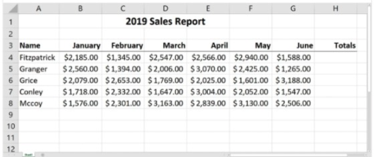

- [ ] AutoSum shows the total in the bottom-right of the page
- [ ] AutoSum will total the numbers in cells B4:G8
- [x] AutoSum will total the numbers in cells B4:G4
- [ ] AutoSum will return a **#VALUE!** error.

#### Q94. To create this PivotTable, drag the _ field to the Rows area and the _ field to the Values area?

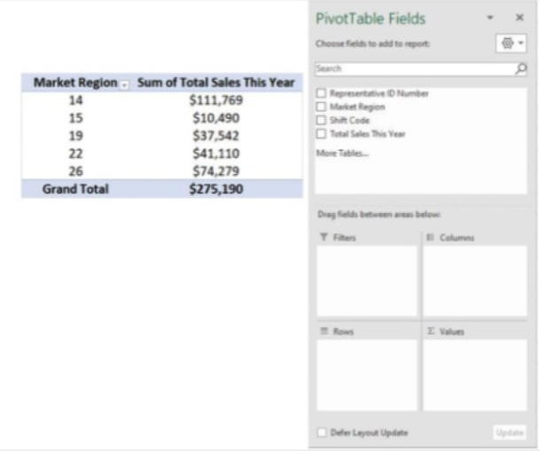

- [ ] Total Sales This Year; Total Sales This Year
- [ ] Total Sales This Year; Market Region
- [ ] Representative ID Number; Total Sales This Year
- [x] Market Region; Total Sales This Year
-

#### Q95. Cell A1 contains the number 3. Which formula returns the text Apple?

- [ ] `=SELECT(A1, "Banana", "Orange", "Apple", "Mango")`
- [x] `=CHOOSE(A1, "Banana", "Orange", "Apple", "Mango")`
- [x] `=CHOOSE(A1,"Banana","Orange","Apple","Mango")`
- [ ] `=MATCH(A1,{"Banana","Orange","Apple","Mango"})`

#### Q96. Which value is calculated when the formula **=AVERAGE(G2:G6)/AVERAGE(C2:C6)** is entered into cell H7?

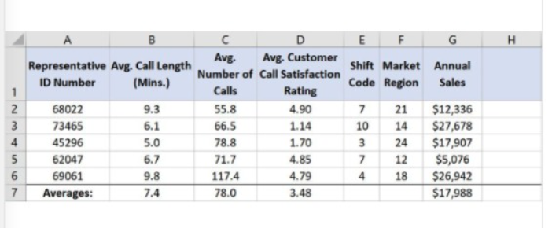

- [ ] average number of minutes per call
- [ ] average annual sales per minute
- [ ] average number sales
- [x] average annual sales per call

#### Q97. How would you search an entire workbook with **Find & Select**?

- [x] On the **Home** tab, click **Find & Select > Find > Options** (Windows) or **Find & Select > Find** (Mac). Change the **Within** drop-down to **Workbook**.
- [ ] On the **Home** tab, click **Find & Select > Find > Options** (Windows) or **Find & Select > Find** (Mac). Change the **Look in** drop-down to **Workbook**.
- [ ] On the **Home** tab, click **Find & Select > Find > Options** (Windows) or **Find & Select > Find** (Mac). Change the **Search** drop-down to **All**.
- [ ] You cannot search an entire workbook - you must search the worksheets individually.

#### Q98. How do you create a heatmap in a table, such as this one, which is responsive to the values?

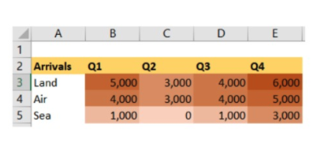

- [ ] map chart
- [x] color scales (within conditional formatting)
- [ ] manual highlighting
- [ ] data bars (within conditional formatting)

#### Q99. To split text across cells without using Merge & Center, click **Formt Cells**. The, on **Alignment** tab, click**\_**.

- [x] Text control > Merge cells
- [ ] Horizontal > Center across selection
- [ ] Vertical > Center across selection
- [ ] Data tab > Text to columns

#### Q100. In the worksheet below, what do the symbols in rows 4, 6, 7, and 11 indicate?

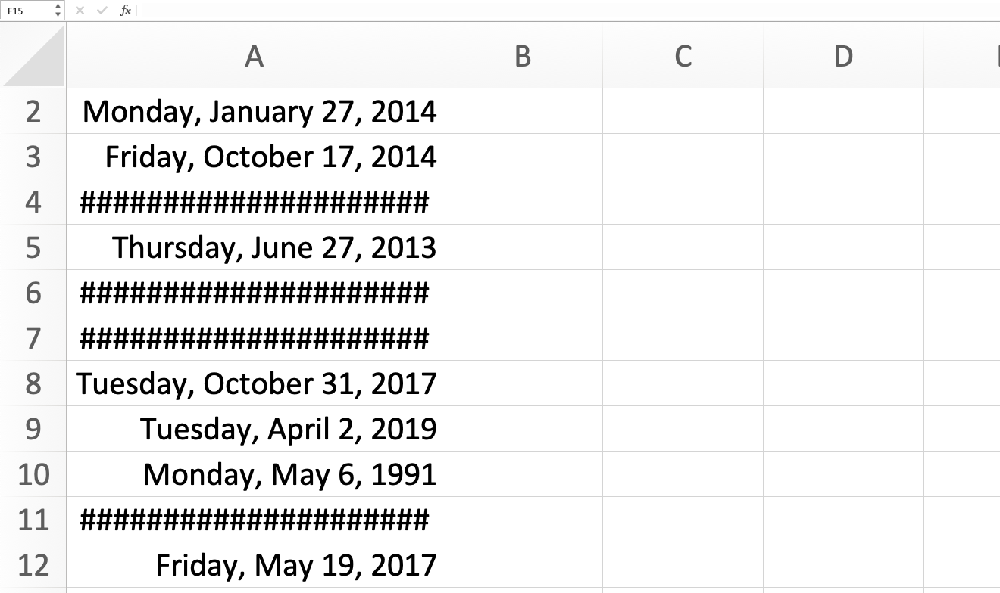

- [ ] The dates are erroneous, such as October 39, 2015.
- [x] The columns aren't wide enough to show the full date.
- [ ] The time are incorrectly formatted as dates.
- [ ] The text is incorrectly formatted as dates.

#### Q101. You are determining `%` growth by dividing Growth by Sales. Which Excel function would you use to avoid #DIV/0! errors?

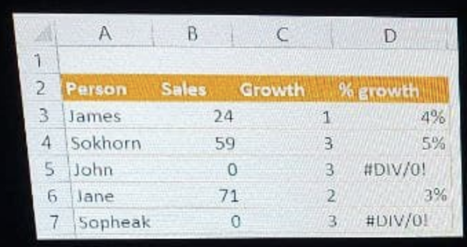

- [x] IFERROR
- [ ] ROUND
- [ ] ISERROR
- [ ] DIVIDE

#### Q103. You have a worksheet in Excel that will print as 10 pages. How can you ensure that the header row is printed at the top of each page?

- [x] Use Print Titles on the Page Layout tab.
- [ ] Use Page Setup from the Backstage View.
- [ ] Use Freeze Panes on the View tab.
- [ ] Format your data as a table; the header prints automatically.

https://support.microsoft.com/en-us/office/print-headings-or-titles-on-every-page-96719bd4-b93e-4237-8f97-d2cabb1b196a

#### Q104. Which value is returned when you enter this function into cell G2? `=IF(SUM(F2:F6)>12,"Too Many Tardy Days","No Tardiness Issue")`

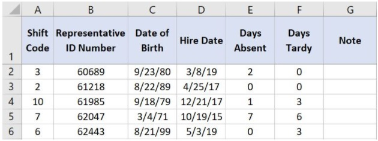

- [ ] Too Many Tardy Days
- [ ] #NUM!
- [x] No Tardiness Issue
- [ ] #REF!

0 + 0 + 3 + 6 + 3 = 12. The formula only dislays "Too Many Tardy Days" when it is more than 12.

#### Q105. What ribbon command on the Home tab can you use to change a cell's fill color automatically, based on the value of the cell?

- [x] Conditional Formatting
- [ ] Format
- [ ] Cell Styles
- [ ] Fill

#### Q106. In this worksheet, how are cells A2:D2 related to cell C4?

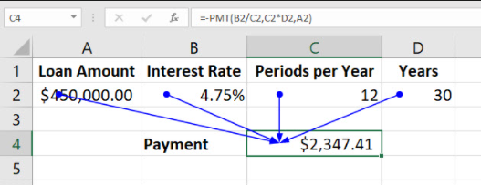

- [ ] Cells A2:D2 are comments relating to the formula in cell C4.
- [ ] Cells A2:D2 are the source of an error in the formula in cell C4.
- [x] Cells A2:D2 are precedents of the formula in cell C4.
- [ ] Cells A2:D2 are dependents of the formula in cell C4.

#### Q107. What is the name given to the numbers in or above each bar in a column chart, as shown?

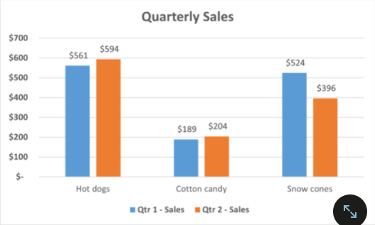

- [ ] data table
- [ ] data numbers
- [x] data labels
- [ ] data values

#### Q108. Which chart type provides the best visual display of the releationship between two numeric variables?

- [ ] radar chart
- [ ] box and whisker chart
- [x] XY scatter chart
- [ ] combo chart

#### Q109. To ensure that a collection of shapes are evenly spaced apart from left to right, select the shapes, click Page Layout > Align, and then click **\_\_**.

- [x] Distribute Horizontally
- [ ] Align Center
- [ ] Distribute Vertically
- [ ] Align Middle

### Q110. A file extension of .xlsm indicates what type of workbook?

- [x] macro-enabled workbook
- [ ] XML-standard workbook
- [ ] Excel 2003 workbook
- [ ] workbook where macros are not allowed

### Q111. A colleague shared an Excel file with you, and you want to display a worksheet that is hidden in it. How can you do that?

- [x] Right-click any worksheet tab and select Unhide.
- [ ] On the View tab, click New Window.
- [ ] On the Home tab, click Unhide.
- [ ] On the Review tab click Unhide Sheet.

### Q112. How do you remove only the conditional formatting from a cell and leave all other formatting intact?

- [ ] This is not possible-you can remove only all formatting from a cell.
- [x] Select the cell. On the Home tab, click Conditional Formatting > Clear Rules > Clear Rules from Selected Cells.
- [ ] Right-click the cell and select Delete Conditional Formatting.
- [ ] Right-click the cell and select Remove Conditional Formatting.

### Q113. If a range name is used in a formula and the name is deleted, what happens to the formula?

- [ ] The formula display a warning but the actual cell address is substituted for the deleted name.
- [ ] The formula becomes invalid and displays a #NAME? error.
- [ ] The actual cell addresses replace the original range name in the formula.
- [ ] The formula becomes invalid and displays a #N/A error

### Q114. To insert a new column to the left of a specific column, right-click the header containing the column's letter and select **\_**.

- [ ] Insert Column
- [ ] Paste Special
- [ ] Insert Column Left
- [x] Insert

### Q115. You want to restric the values entered in a cell to a speified set, such as Hop, Skip, Jump. Which type of data validation should you use?

- [ ] input range
- [x] list
- [ ] custom
- [ ] database

### Q116. Given the image below, what happens if you type "P" in cell A6?

- [ ] The letter "P" appears.
- [x] The word "Perez" appears and the active cell remains in Edit mode.
- [ ] A pop-up list appears with the previous four names.
- [ ] The word "Perez" appears and immediately the active cell moves down.

### Q117. You want to find the second-largest invoice in a column containing all the invoices in a given month. What function would you use?

- [ ] NEXT
- [ ] MAX
- [x] LARGE
- [ ] MATCH

### Q118. How can you see the data in column E?

- [ ] Close the workbook without saving and reopen it.
- [ ] Turn off conditional formatting.
- [x] On the Home tab of the ribbon, select Fit to Column.
- [ ] Expand the width of its column.

### Q119. In the worksheet below, a table called Projects extends from cell A1 to D10. Cell D1 contains the text Status. Cell E12 contains the formula =Projects[@Status]. What does this formula return?

- [ ] #VALUE!
- [ ] a blank cell
- [x] #REF!
- [ ] 0

### Q120. Which Excel feature allows you to select all cells in the column with inconsistent formulas compared to the rest of the column?

- [x] On the Home tab, click Go To > Special > Column differences.
- [ ] On the Formulas tab, click Trace precedents.
- [ ] On the Formulas tab, click Trace errors.
- [ ] On the Formulas tab, click show formulas

### Q121. You want to restrict the values entered in a cell to a specified set, such as hop, skip, jump. Which type of data validation should you use??

- [ ] database.
- [x] list.
- [ ] input range.
- [ ] custom

[reference](https://www.extendoffice.com/documents/excel/3830-excel-only-allow-certain-values.html)
